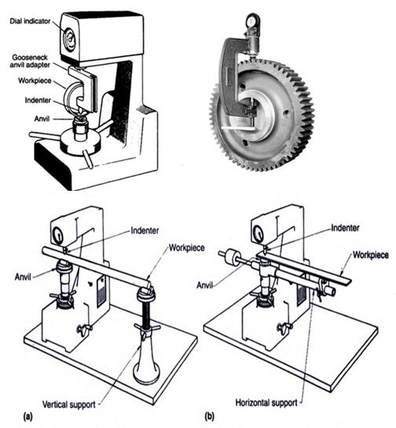

Hardness represents the resistance of material surface to abrasion, scratching and cutting, hardness after gives clear indication of strength. In all hardness tests, a define force is mechanically applied on the piece, varies in size and shape for different tests. Common indenters are made of hardened steel or diamond. Rockwell hardness tester presents direct reading of hardness number on a dial provided with the machine. Principally this testing is similar to brinell hardness testing. It differs only in diameter and material of the indenter and the applied force. Although there are many scales having different combinations of load and size of indenter but commonly 'C' scale is used and hardness is presented as HRC. Here the indenter has a diamond cone at the tip and applied force is of 150 kgf. Soft materials are often tested in 'B' scale with a 1.6mm dia. Steel indenter at 60kgf.

**Types of Rockwell Test**:

1. **Rockwell Test**: In this minor load of 10kgf and major loads of 60, 100, 150kgf is applied.
2. **Superficial Rockwell Test**: In this minor load of 3kgf and major loads of 15, 30, 45kgf is applied.

**Specification of Hardness Testing M/C and Indenters**:

Rockwell hardness testing machine essentially consist of a supporting table for placing the specimen, a hand wheel to raise or lower the supporting table, a Rockwell ball indenter which is a hardened steel ball 1/6'' in diameter, a Rockwell cone indenter which is a diamond cone of 120°.

Apex angle: load stages adjustable by means of push button switches, a light signal to indicate the application of minor load of 10kg, a clamping sleeve to hold the specimen firmly, a button for applying the major load, hand lever to release the load and a dial gauge which directly gives the Rockwell hardness number. The dial gauge has two set of graduation B and C, corresponding to the ball type indenter and the cone type indenter.

The hardness test can also be conducted on Brinell testing m/c, Rockwell hardness m/c or Vickers testing m/c the specimen may be a cylinder, cube, thick or thin metallic sheets.

The Rockwell hardness test is a indentation hardness test in which a diamond cone having an included angle of 120o and radius of curvature at the tip of 0.2mm, or a hardened steel or hard metal ball having a diameter of 1.5875mm for B, F, G and all 'T' scales or 3.175 mm for E, H and K scales are used.The indenter is forced into the surface of a test piece in two steps, initially a minor load of 10kg is applied to a penetrator causing an indentation d1 in the test specimen, application of minor load eliminates backlash in load terrain and causes indenter to break through surface roughness, contributing to accuracy in test. With minor load still operating major load is added according to above table. The application of major load increases the depth of penetration. Some material show considerable time-dependent plasticity, the duration of application of major load shall be neither less than 10s nor greater than 15s. Then the major load is removed with the minor load is still acting. This operation results in the partial recovery in the depth of indentation.

If d2 is the depth of indentation under this condition then the permanent increase of depth of indentation due to the application of major load is d2-d1.

Rockwell hardness for diamond indenter

Rockwell hardness for ball indenter

While testing the specimen following cares should be taken

1. Indentation should not be made nearer to the edge of a specimen to avoid unnecessary concentration of stresses. In such case the distance from the edge to the centre of indentation should be greater than 2.5 times diameter of indentation.
2. The spacing between the two adjacent impressions should be at least 3 times the diameter of indentation.
3. Rapid rate of applying load to the specimen should be avoided. Load applied on the ball may rise a little because of its sudden action, also rapidly applied load will restrict plastic flow of a material, which produces effect on size of indentation.

**Test Specimen**:

The selected specimen shall have a thickness greater than 10 times the depth of indentation to avoid the deformation to be extended to the opposite surface of a specimen. After the test, no deformation shall be visible on the surface of the test piece opposite to the indentation. The surface of the test specimen shall be smooth and even, free from oxide scale, foreign matter and, in particular completely free from lubricants. For tests on convex cylindrical surfaces and spherical surfaces, the corrections should be added according to IS 1586: 2012.Flat pieces should be tested on a flat anvil that has a smooth flat bearing surface whose plane is perpendicular to the axis of the penetrator. For pieces that are not perfectly flat, a flat anvil having an elevated 'spot' about 4 to 6 mm in diameter is used.

Commonly used types of anvils

**Testing hardness of different types of work pieces**:

**RELEVANT INDIAN STANDARD FOR ROCKWELL TEST**:

1. IS 1586 (Part 1): 2012, Metallic materials - Rockwell hardness test: Part 1 Test method (scales A, B, C, D, E, F, G, H, K, N, T), Fourth revision, 2012.

2. IS 1586 (Part 1): 2012, Metallic materials - Rockwell hardness test: Part 1 Test method (scales A, B, C, D, E, F, G, H, K, N, T), Fourth revision, 2012.
