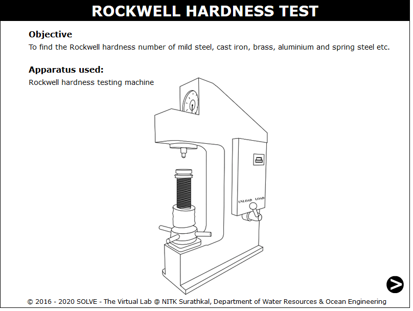
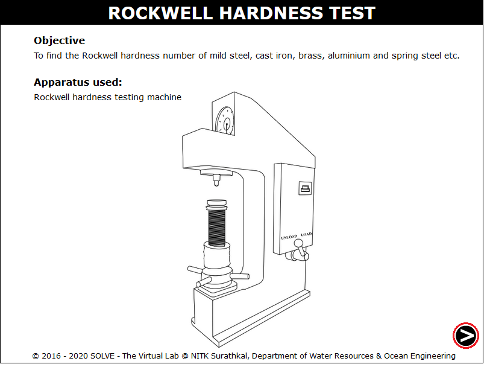
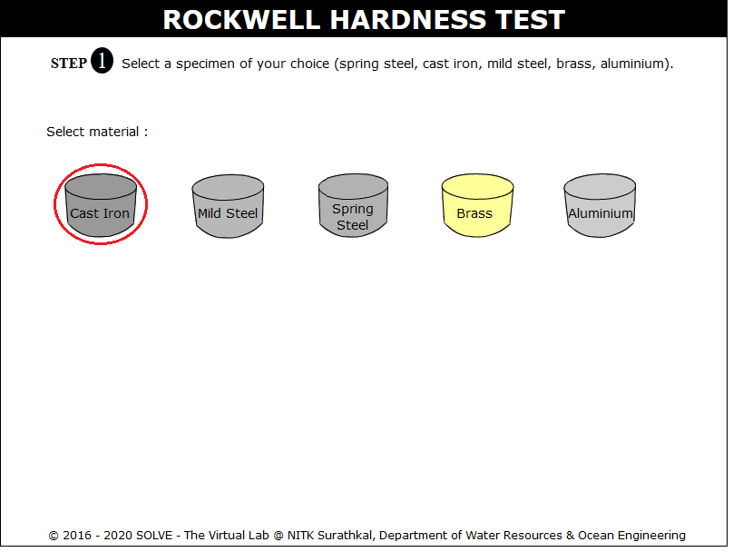
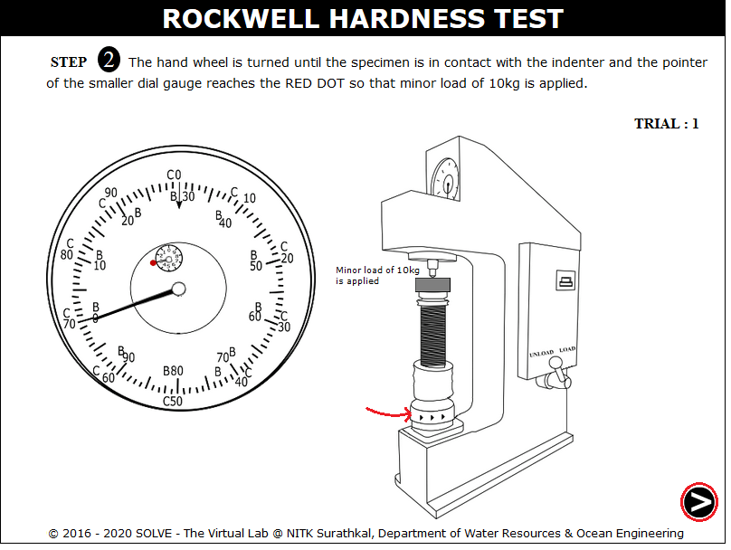
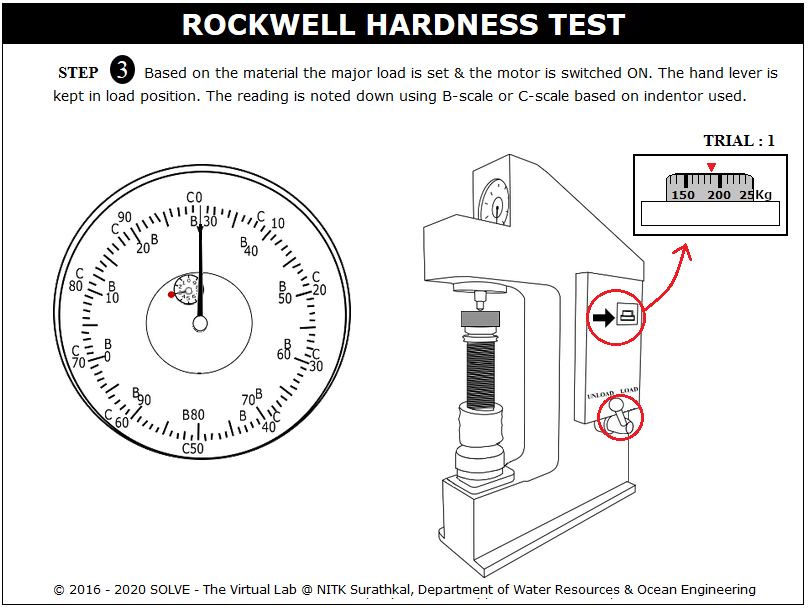
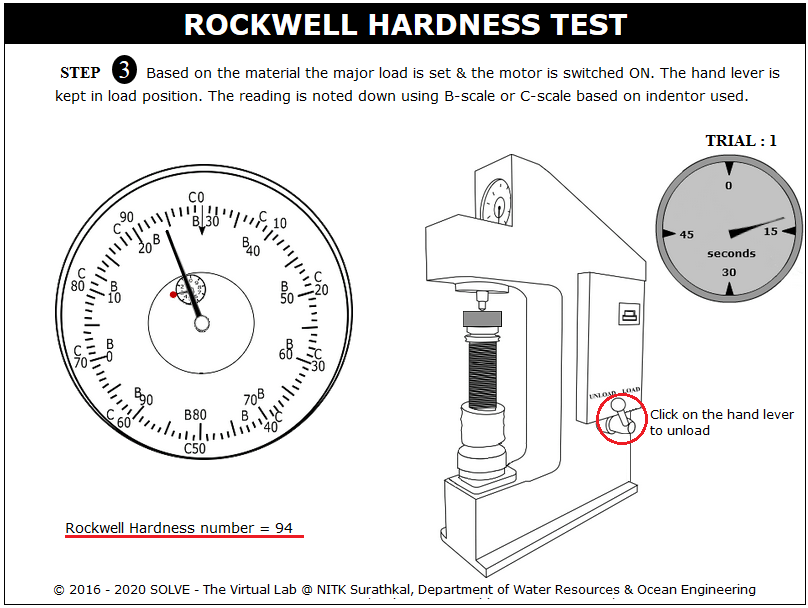
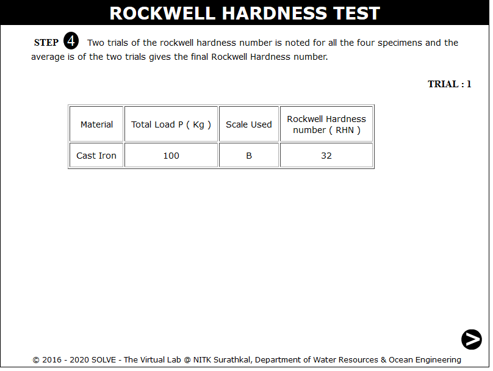
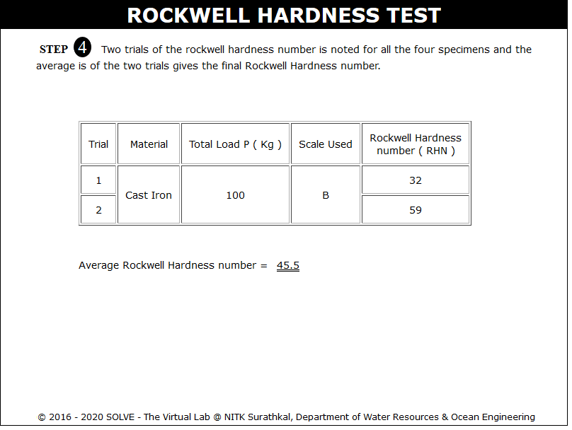

**OBJECTIVE**:

To find the Rockwell hardness number of mild steel, cast iron, brass, aluminium and spring steel etc.

**STEPS**:

1. Click on the Rockwell Hardness Test file, a window will open as shown.  
   

2. Click on the next step to continue.  
   

3. Select the specimen and also the indenter to be used.  
   

4. Move mouse pointer over the hand wheel to apply 10Kg minor load on the specimen.  
   

5. The major load is set by rotating the knob, hand lever is pulled to load position.  
   

6. Again click on hand lever to stop the loading process,then note down the reading.  
   

7. The results of the first trial.  
   

8. All the above steps are repeated for the second trial and the average Rockwell hardness number for the selected specimen is obtained.  
   
